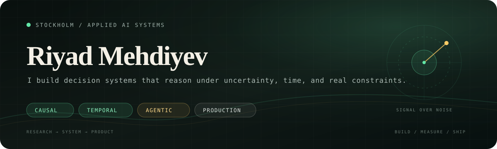

<p align="center">
  
</p>

<p align="center">
  <a href="https://www.linkedin.com/in/riyad-mehdiyev/"></a>
  <a href="mailto:riyadmehdi17@gmail.com"></a>
  <a href="https://github.com/RiyadMehdi7?tab=repositories"></a>
</p>

I am a data scientist and AI product builder in Stockholm. I work where **machine-learning research meets operational software**: causal decision systems, temporally grounded retrieval, reliable AI agents, and full-stack analytics products.

My favorite problems are not just “can a model predict this?” They are: **what should happen next, why, for whom, and with what evidence?**

<br />

## Current coordinates

```text
BUILDING   ChurnVision · governed retention intelligence and decision workflows
STUDYING   Small-model reasoning · memory · verification · temporal fidelity
SHIPPING   Python/FastAPI · TypeScript/React · Docker · data platforms
PRINCIPLE  Research is useful when it survives contact with a real workflow
```

## Selected systems

<table>
<tr>
<td width="50%" valign="top">

### [Cognitive LLM](https://github.com/RiyadMehdi7/cognitive-llm)

Controlled ablations of six neuroscience-inspired modules around a frozen small-language-model backbone.

**Signal:** the strongest Phase 1 configuration reached `2.718` validation loss versus a `6.299` baseline.

`PyTorch` · `LoRA` · `Ablation research`

</td>
<td width="50%" valign="top">

### [CRVerify-P](https://github.com/RiyadMehdi7/CRVerify-P)

Adaptive selection of reasoning paths that balances expected correctness against verification cost.

**Signal:** confidence-aware stopping, partial-path coverage, and reproducible synthetic and real runners.

`Python` · `Bandits` · `Reasoning verification`

</td>
</tr>
<tr>
<td width="50%" valign="top">

### [TemporalRAG-Lite](https://github.com/RiyadMehdi7/TemporalRAG-Lite)

A retrieval toolkit for answering with evidence that was valid at the requested point in time.

**Signal:** time-sliced corpora, temporal-leakage metrics, recency guards, and calibrated abstention.

`RAG` · `Evaluation` · `Temporal fidelity`

</td>
<td width="50%" valign="top">

### [AgentSync MCP](https://github.com/RiyadMehdi7/agentsync)

Coordination infrastructure for multiple AI coding agents working in one codebase.

**Signal:** shared file locks, live work tracking, semantic conflict detection, and merge assistance.

`MCP` · `Developer tooling` · `Multi-agent systems`

</td>
</tr>
<tr>
<td width="50%" valign="top">

### [CHRONOS](https://github.com/RiyadMehdi7/CHRONOS)

A causal-temporal framework for employee retention decisions under budget and fairness constraints.

**Signal:** survival modeling, treatment-effect estimation, policy learning, and value-aware evaluation.

`Causal ML` · `Survival analysis` · `Policy learning`

</td>
<td width="50%" valign="top">

### [AECRL](https://github.com/RiyadMehdi7/AECRL)

Adaptive curriculum reinforcement learning driven by the model's own semantic uncertainty.

**Signal:** dynamic difficulty estimation, GRPO training, baselines, recovery, and evaluation tooling.

`RLHF` · `Semantic entropy` · `Curriculum learning`

</td>
</tr>
</table>

## Operating range

| Layer | What I work on |
|---|---|
| **Intelligence** | causal inference, survival models, RAG, LLM evaluation, reinforcement learning |
| **Product** | decision workflows, analytics UX, role-aware systems, human-in-the-loop AI |
| **Platform** | FastAPI, React/TypeScript, PostgreSQL, Docker, CI/CD, observability |
| **Standard** | reproducible experiments, explicit uncertainty, privacy boundaries, measurable outcomes |

<p align="center">
  
  
  
  
  
  
</p>

<br />

> **The thread through my work:** turn ambiguous signals into decisions people can inspect, challenge, and use.

<p align="right"><sub>Stockholm, Sweden · Open to ambitious AI systems and applied research conversations</sub></p>
